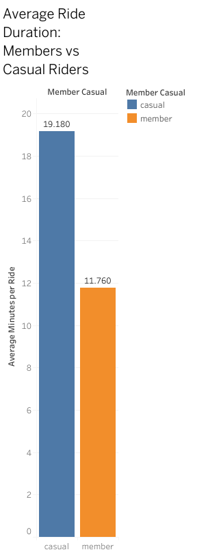
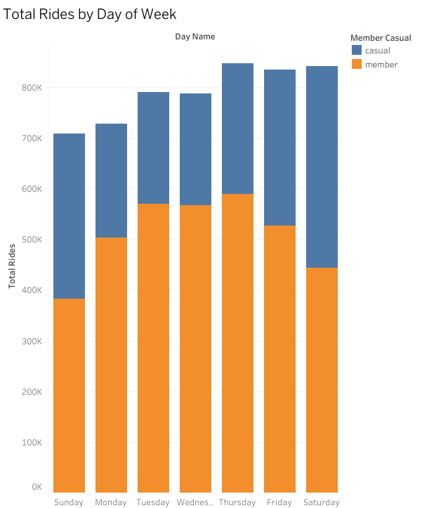
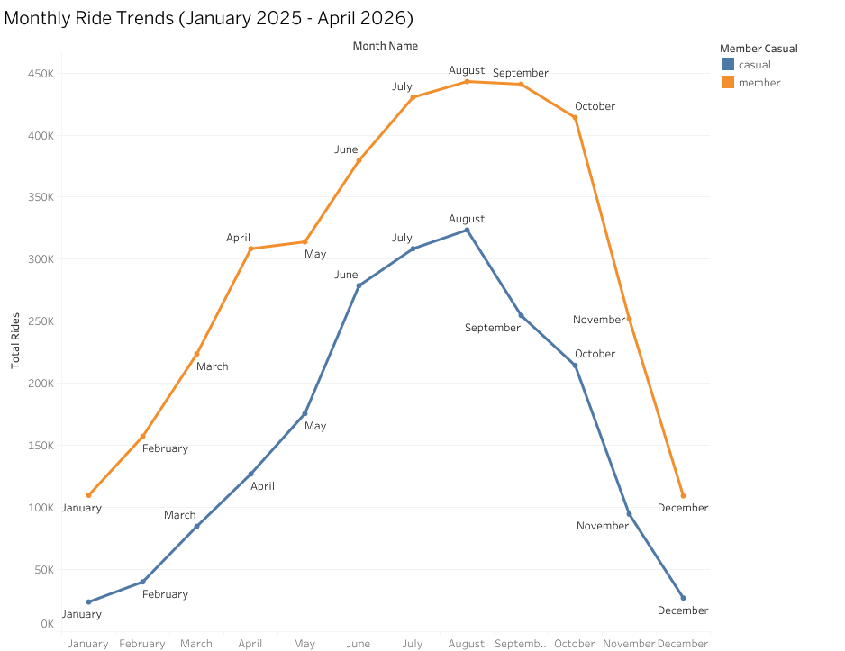
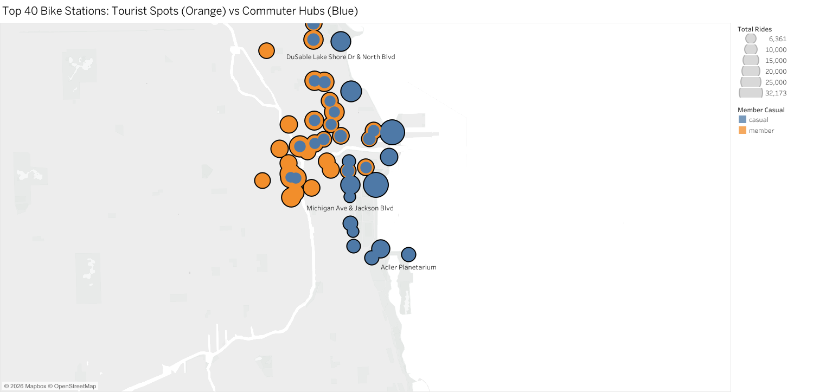
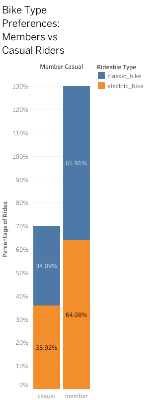
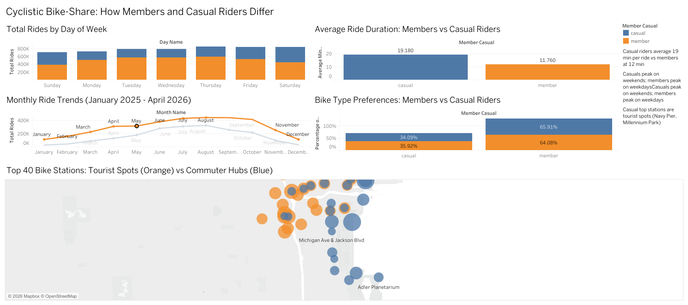

# Cyclistic Bike-Share: Member vs. Casual Rider Analysis

[](./sql/)
[](https://public.tableau.com/app/profile/nikhilvarma.kandula)
[](./data/)
[](./reports/cyclistic_report.pdf)
[](./LICENSE)

  
**Author:** Nikhilvarma Kandula · **Period:** May 2025 – April 2026 · **Tool:** Google BigQuery + Tableau Public

---

## Business Objective

Cyclistic's marketing team needs to convert casual riders into annual members. This analysis answers three questions:

1. **How do annual members and casual riders use Cyclistic bikes differently?**
2. **Why would casual riders buy Cyclistic annual memberships?**
3. **How can Cyclistic use digital media to influence casual riders to become members?**

---

## Dataset at a Glance

| Metric | Value |
|--------|-------|
| Source | Divvy Bikes public trip data (Motivate International Inc.) |
| Period | May 2025 – April 2026 (12 months) |
| Raw rows | ~5,693,303 across 12 CSV files (~245 MB) |
| Rows after cleaning | **5,535,455** (~2.8% removed) |
| Annual members | **3,582,548 (64.7%)** |
| Casual riders | **1,952,907 (35.3%)** |
| Bike types | `electric_bike` · `classic_bike` |

---

## Key Findings

### Finding 1 — Ride Duration: Casuals Ride 63% Longer

| Rider Type | Avg Duration | Total Rides |
|------------|-------------|-------------|
| Casual | **19.2 min** | 1,952,907 |
| Member | **11.8 min** | 3,582,548 |

The gap widens sharply on classic bikes:

| Bike Type | Casual Avg | Member Avg | Ratio |
|-----------|-----------|-----------|-------|
| Electric Bike | 14.3 min | 10.9 min | 1.31× |
| **Classic Bike** | **28.7 min** | **13.4 min** | **2.14×** |

Classic-bike casual rides averaging 28.7 minutes are the strongest leisure indicator in the entire 5.5M-row dataset — these are lakefront explorations, not commutes.



---

### Finding 2 — Weekly Patterns: Casuals Ride Weekends, Members Ride Weekdays

| Day | Casual Rides | Member Rides | Casual Share |
|-----|-------------|-------------|-------------|
| Sunday | 325,077 | 383,108 | 46% |
| Monday | 223,743 | 503,442 | 31% |
| Tuesday | 220,387 | 569,292 | 28% |
| Wednesday | 220,429 | 567,025 | 28% |
| Thursday | 258,310 | **589,185** ← member peak | 30% |
| Friday | 306,955 | 527,383 | 37% |
| **Saturday** | **398,006** ← casual peak | 443,113 | **47%** |

- **37%** of all casual rides occur on Saturday + Sunday
- **77%** of all member rides occur Monday through Friday
- Saturday casual rides are **78% higher** than Monday casual rides

Members are infrastructure users — bikes are transport. Casuals are leisure consumers — bikes are an activity.



---

### Finding 3 — Seasonal Trends: Casuals Are 4.5× More Seasonal

| Month | Casual Rides | Member Rides | Casual Share |
|-------|-------------|-------------|-------------|
| January | 23,876 | 109,855 | 18% |
| February | 40,072 | 157,230 | 20% |
| March | 84,796 | 223,643 | 27% |
| April | 127,025 | 308,470 | 29% |
| May | 175,648 | 313,994 | 36% |
| June | 278,675 | 379,517 | 42% |
| July | 308,429 | 430,392 | 42% |
| **August** | **323,523** ← casual peak | **443,125** ← member peak | **42%** |
| September | 254,714 | 440,951 | 37% |
| October | 214,373 | 414,088 | 34% |
| November | 94,689 | 251,912 | 27% |
| December | 27,087 | 109,371 | 20% |

| Metric | Casual | Member |
|--------|--------|--------|
| Peak month | August (323K) | August (443K) |
| Winter trough | January (24K) | January (110K) |
| Seasonal drop | **93%** | 75% |
| May–Sep share | **72% of annual casual rides** | 59% |

Casual ridership nearly disappears in winter. **The May–September window is the only realistic time to run conversion campaigns.**



---

### Finding 4 — Station Geography: Casuals Cluster at Tourist Hotspots

Top 10 casual start stations (all tourist/leisure locations):

| Rank | Station | Casual Rides |
|------|---------|-------------|
| 1 | Navy Pier | 32,173 |
| 2 | DuSable Lake Shore Dr & Monroe St | 31,083 |
| 3 | Michigan Ave & Oak St | 22,257 |
| 4 | DuSable Lake Shore Dr & North Blvd | 19,273 |
| 5 | Streeter Dr & Grand Ave | 18,910 |
| 6 | Millennium Park | 18,566 |
| 7 | Shedd Aquarium | 16,556 |
| 8 | Theater on the Lake | 15,635 |
| 9 | DuSable Harbor | 15,171 |
| 10 | Michigan Ave & 8th St | 10,882 |

Top 3 casual stations alone = **81,313 rides combined.** Member stations are distributed across commuter corridors city-wide — no tourist concentration.

> **Query note:** An initial `ORDER BY total_rides LIMIT 40` returned only casual stations (their tourist concentrations dominated). Fixed with a `UNION ALL` of two separate `TOP 20 PER GROUP` queries — see `sql/03_analysis_queries.sql` Analysis 4B and `documentation/challenges_and_solutions.md` Challenge 4.



---

### Finding 5 — Bike Type: Electric vs Classic Split Is Identical; Duration Is Not

| Group | Bike Type | Rides | % of Group | Avg Duration |
|-------|-----------|-------|-----------|-------------|
| Casual | Electric Bike | 1,294,903 | 66% | 14.3 min |
| Casual | Classic Bike | 658,004 | 34% | **28.7 min** |
| Member | Electric Bike | 2,310,294 | 65% | 10.9 min |
| Member | Classic Bike | 1,272,254 | 35% | **13.4 min** |

Both groups choose electric bikes ~65% of the time — bike preference alone does not distinguish them. The signal is the **2.14× duration gap on classic bikes**: casual classic rides are leisure sightseeing; member classic rides are functional trips.



---

### Bonus Finding — Peak Hour: Leisure Arc vs Commuter Twin-Peak

| Rider Type | Morning | Midday–Afternoon | Evening |
|------------|---------|-----------------|---------|
| **Member** | Peak 8–9 AM | Moderate | Peak 5–7 PM |
| **Casual** | Flat | **Peak 11 AM–6 PM** | Tapering |

Members show a classic commuter twin-peak (in + out). Casuals show a single broad leisure block. Optimal in-app ad delivery windows for casual riders: **Friday 4–8 PM and Saturday 10 AM–2 PM.**

---

## Marketing Recommendations

### Recommendation 1 — Weekend & Summer Conversion Campaign `HIGH PRIORITY`

**Evidence:** Saturday casual peak = 398K rides · May–Sep = 72% of casual annual rides · 93% winter drop  
**Action:** Launch a "Weekend Rider → Annual Member" upgrade offer May–August. Target casuals with 3+ rides in 30 days via in-app push notification. Physical promotions at top casual stations Friday–Sunday.  
**Impact:** 5% conversion of 1.95M casuals = **~97,500 new annual members**

Answers business question 3: digital in-app notifications triggered by ride frequency are the highest-ROI digital channel for this audience.

---

### Recommendation 2 — Point-of-Use Digital Ads at Casual Hotspot Stations `HIGH PRIORITY`

**Evidence:** Top 3 stations = 81,313 rides · All tourist/leisure locations · Casual share peaks at 47% on Saturdays  
**Action:** Install QR-code displays at the top 10 casual stations showing live cost comparison: *"5 rides this month? Membership pays for itself in 8 rides."* Link to 60-second mobile sign-up.  
**Impact:** Highest-intent touchpoint — captured at the moment of payment, physically using the service.

Answers business question 2: casual riders already pay per ride at tourist hotspots. A cost-savings message at point of use is the clearest financial argument for membership.

---

### Recommendation 3 — Reframe Membership as Leisure Lifestyle `MEDIUM PRIORITY`

**Evidence:** 19.2 min casual avg · 28.7 min classic-bike casual avg · All top casual stations are leisure destinations  
**Action:** Replace commuter-centric messaging with leisure messaging: *"Ride longer. Explore more. Pay less."* Use lakefront and weekend imagery. Deploy on Instagram and TikTok targeting Chicago area.  
**Impact:** Changes the value proposition for 1.95M leisure-first riders who do not identify as commuters.

Answers business question 3: casual riders respond to lifestyle messaging, not efficiency messaging — the data proves they are not using bikes to commute.

---

## Tableau Dashboard



**[→ View Interactive Dashboard on Tableau Public](https://public.tableau.com/app/profile/nikhilvarma.kandula)**

---

## Data Cleaning Summary

All cleaning performed in Google BigQuery. Full log: [`documentation/data_cleaning_log.md`](./documentation/data_cleaning_log.md)

| Issue | Check | Decision | Rows Removed |
|-------|-------|----------|-------------|
| Missing GPS end coordinates | `end_lat IS NULL OR end_lng IS NULL` | Delete — cannot be mapped | ~5,732 |
| Rides under 1 minute | `ride_length_minutes < 1` | Delete — false starts/test rides | ~155,945 |
| Rides over 24 hours | `ride_length_minutes > 1440` | Delete — unreturned/lost bikes | ~6,491 |
| Negative durations | `ride_length_minutes < 0` | Delete — timestamp errors (DST) | 29 (Nov only) |
| Blank station names | `start_station_name IS NULL` | **Keep** — valid app-unlocked rides | 0 removed |
| Duplicate ride IDs | `COUNT(*) > 1` | None found | 0 |
| February timestamp corruption | Excel re-save corrupted datetime type | `PARSE_TIMESTAMP` conversion | 0 removed |

**Engineered columns added:**
- `ride_length_minutes` = `TIMESTAMP_DIFF(ended_at, started_at, MINUTE)`
- `day_of_week` = `EXTRACT(DAYOFWEEK FROM started_at)` (1=Sunday … 7=Saturday)

---

## Repository Structure

```
cyclistic-bikeshare-case-study/
├── README.md
├── sql/
│   ├── 01_data_cleaning.sql          ← Cleaning queries (12 months, one block each)
│   ├── 02_data_merging.sql           ← UNION ALL: 12 monthly tables → all_trips_clean
│   └── 03_analysis_queries.sql       ← 6 analysis queries + inline results
├── data/
│   ├── raw/                          ← Sample of original Divvy CSV
│   ├── processed/                    ← Cleaned monthly tables (exported CSVs)
│   └── analyzed/
│       ├── ride_length_summary.csv   ← Finding 1 output
│       ├── rides_by_day.csv          ← Finding 2 output
│       ├── monthly_trends.csv        ← Finding 3 output
│       ├── top_stations.csv          ← Finding 4 output
│       └── bike_type_usage.csv       ← Finding 5 output
├── visualizations/
│   ├── tableau_dashboard.png
│   ├── avg_ride_length.png
│   ├── rides_by_day.png
│   ├── monthly_trends.png
│   ├── bike_type_usage.png
│   └── station_map.png
├── documentation/
│   ├── key_findings.md               ← Full findings with data tables
│   ├── data_cleaning_log.md          ← Every cleaning decision documented
│   └── challenges_and_solutions.md   ← 9 real problems solved during the project
└── reports/
    ├── cyclistic_presentation.pdf    ← 9-slide executive deck
    └── cyclistic_report.pdf          ← Full analysis report
```

---

## How to Reproduce

**Prerequisites:** Google Cloud Platform account (free tier) · Tableau Public (free)

1. Download 12 months of trip data from [divvy-tripdata.s3.amazonaws.com](https://divvy-tripdata.s3.amazonaws.com/index.html)
2. Upload all CSVs to Google Cloud Storage (files exceed BigQuery's 100 MB direct upload limit)
3. Load from GCS into BigQuery as 12 raw tables
4. Run [`sql/01_data_cleaning.sql`](./sql/01_data_cleaning.sql) — one block per month
5. Run [`sql/02_data_merging.sql`](./sql/02_data_merging.sql) — creates `all_trips_clean` (5.5M rows)
6. Run [`sql/03_analysis_queries.sql`](./sql/03_analysis_queries.sql) — produces all 6 analysis results
7. Export each result as CSV and load into Tableau Public
8. Build visualizations referencing the dashboard layout

> **Note:** Never open raw CSVs in Excel. Excel corrupts datetime columns on re-save (confirmed in the February 2026 file — see `documentation/challenges_and_solutions.md` Challenge 3).

---

## Technical Skills Demonstrated

- **SQL (BigQuery):** CTEs, window functions (`SUM OVER PARTITION BY`), `TIMESTAMP_DIFF`, `EXTRACT`, `PARSE_TIMESTAMP`, `UNION ALL`, `CREATE OR REPLACE TABLE`
- **Data Cleaning:** Systematic outlier removal with documented rationale; distinguishing missing data from valid patterns (blank station names = app-unlocked rides)
- **Cloud Infrastructure:** Google Cloud Storage for large file ingestion; BigQuery dataset and table management
- **Data Visualization:** Tableau Public — maps, dual-axis charts, grouped bars, interactive dashboards
- **Statistical Analysis:** Descriptive statistics, group segmentation, seasonality measurement, ratio analysis
- **Business Communication:** Every finding mapped directly to a recommendation; every recommendation tied to a business question

---

## Limitations

1. **No user-level data** — cannot track individual casual riders across trips (privacy protection)
2. **No pricing data** — cannot calculate revenue per trip or ROI for recommendations
3. **No demographic data** — cannot segment casuals by tourist vs local, age, or income
4. **12-month snapshot** — seasonal patterns assumed to repeat; year-over-year trends unknown
5. **No competitor data** — cannot assess whether casuals also use competing services

---

## Documentation

- [Key Findings (detailed)](./documentation/key_findings.md) — full data tables, per-finding SQL references, visualization links
- [Data Cleaning Log](./documentation/data_cleaning_log.md) — every decision documented with row counts
- [Challenges & Solutions](./documentation/challenges_and_solutions.md) — 9 real problems encountered and how they were resolved

---

## About

This case study demonstrates my ability to:
- Clean and analyze large datasets (5M+ rows)
- Use industry-standard tools (SQL, BigQuery, Tableau)
- Derive actionable business insights from data
- Communicate findings to non-technical stakeholders

**Connect with me:**
- 💼 [LinkedIn](https://www.linkedin.com/in/nikhilvarmakandula)
- 📧 [Email](mailto:kandulanikhilvarma@gmail.com)
- 🌐 [Portfolio](https://kandula.studio)

---

*Data license: Motivate International Inc. public use agreement. Code and documentation: MIT License.*  
*Last updated: May 2026*
